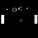
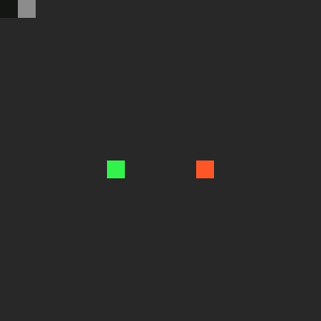
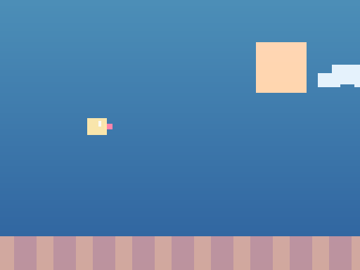

# G9 - Just In Time Image Processing With Eclipse OMR

An implementation of Luke Dodd's Pixslam https://github.com/lukedodd/Pixslam using Eclipse OMR JitBuilder.
See [Original README](README_ORIG.md) for the original project README.

#### Carleton University Honours Project Winter 2019. Under the supervision of David Mould. ####

## Getting Started

### Installing

Requires CMake and a C++ compiler. SDL2 is optional and enables `--preview` for runtime programs.
Works on macOS and Ubuntu Linux.

```bash
git clone --recurse-submodules https://github.com/gaduimovich/gNine
cd gNine
cmake -S . -B build
cmake --build build --target gnine gnine_runtime_tests gnine_semantic_tests gnine_color_tests -j4
```

### Running

Box Filter
```sh
./build/gnine ./examples/box_3x3.psm ./example_data/lena.png out.png
```

Runtime RGB Triptych
```sh
./build/gnine --runtime ./examples/rgb_triptych.psm ./example_data/lena.png rgb_triptych.png
```

Runtime Pong
```sh
./build/gnine --runtime --emit-frames=runtime_pong_v2.png ./examples/runtime_pong_v2.psm runtime_pong_v2_final.png
```

Runtime Snake Preview
```sh
./build/gnine --runtime --preview ./examples/runtime_snake_v2.psm runtime_snake_v2.png
```

Runtime Flappy Bird Preview
```sh
./build/gnine --runtime --preview --display-scale=auto ./examples/runtime_flappy_bird_v2.psm runtime_flappy_bird_v2.png
```

### Testing

Build the test targets:

```bash
cmake --build build-arm64 --target gnine_runtime_tests gnine_semantic_tests gnine_color_tests -j4
cmake --build build-x86_64 --target gnine_runtime_tests gnine_semantic_tests gnine_color_tests -j4
```

Run the test binaries:

```bash
./build-arm64/tests/gnine_runtime_tests
./build-arm64/tests/gnine_semantic_tests
./build-x86_64/tests/gnine_runtime_tests
./build-x86_64/tests/gnine_semantic_tests
```

## Examples

* `box_3x3.psm`, `box_5x5.psm`, `threshold.psm`, `posterize_4.psm` - basic image filters
* `abs_edges.psm`, `halo_edges.psm`, `detail_boost.psm`, `midtones_notch.psm` - edge and detail effects
* `compose.psm`, `min.psm` - compositing examples
* `metaballs.psm`, `metaballs_binary.psm`, `metaballs_fancy.psm` - procedural image generation
* `sepia_vector.psm`, `chroma_key_green.psm`, `rgb_triptych.psm` - RGB and vector color examples
* `runtime_pong_v2.psm` - stateful runtime demo built with `iterate-until`
* `runtime_snake_v2.psm` - interactive runtime preview demo built with `iterate-until`
* `runtime_flappy_bird_v2.psm` - Flappy Bird style runtime game built with `iterate-until`
* `examples/game_of_life/game_of_life.psm` - chained cellular automata example

## Language Guide

See [docs/language-guide.md](docs/language-guide.md) for the actual language reference:

* syntax and execution model
* scalar sampling, vector/color forms, and runtime forms
* tuples, arrays, lambdas, and chained state
* game-oriented patterns and performance tricks

## New Features

### Language Features

* Scalar arithmetic includes `+`, `-`, `*`, `/`, `min`, `max`, `abs`, `clamp`, and `int`.
* Scalar comparison and boolean forms include `<`, `<=`, `>`, `>=`, `==`, `!=`, `and`, `or`, `not`, and `if`.
* Compiled scalar code exposes `width` and `height` as symbols; runtime code exposes `(width A)`, `(height A)`, and `(channels A)`.
* Tuple forms include `tuple`, `get`, and tuple destructuring in arguments and lambda parameters.
* Array forms include `array`, `array-length`, `array-get`, `array-set`, `array-push`, `array-pop`, `array-slice`, and `array-fold`.
* Top-level chained execution forms include `iterate`, `iterate-state`, and `iterate-until`.
* The chained runtime iterator variable `iter` exposes the current 1-based step count.
* RGB and vector forms include `vec`, `rgb`, `color`, `r`, `g`, `b`, and `dot`.
* Runtime image forms include `map-image`, `zip-image`, and `canvas`.
* Runtime canvas drawing adds `draw-rect` and `draw-circle`.
* `pipeline` fuses scalar stages into a single lowered kernel.

### Runtime Helpers

* `--runtime` executes managed image programs and can JIT fast paths for `map-image`, `zip-image`, and `canvas`.
* Output helpers add `--emit-frames`, `--compare`, `--display-scale`, and `--display-size`.
* Runtime preview/input bindings add `--preview` plus keyboard, mouse, and frame-time inputs for interactive programs.
* Benchmarking helpers add `--benchmark`, `--benchmark-no-write`, and `--benchmark-repeats=N`.

## Benchmarking

There are three useful benchmark modes:

* Non-runtime image/filter benchmarks.
* Single-pass runtime benchmarks.
* Chained runtime game benchmarks.

### 1. Non-runtime image/filter benchmarks

Use this for regular lowered kernels such as box filters, thresholding, or vector/color programs.

```bash
./build-arm64/gnine --benchmark ./examples/box_3x3.psm ./example_data/lena.png /tmp/box_3x3_bench.png
```

Useful flags:

* `--benchmark` prints timing metrics.
* `--benchmark-no-write` skips writing the output image.
* `--times=N` reruns the same kernel N times.
* `--chain-times=N` benchmarks chained non-runtime iteration on a single input image.

### 2. Single-pass runtime benchmarks

Use this for runtime programs that execute once per invocation and do not depend on chained state.

```bash
./build-arm64/gnine --runtime --benchmark --benchmark-repeats=10 --benchmark-no-write \
  ./examples/canvas_bench_color_squares_1080p.psm /tmp/canvas_bench.png
```

`--benchmark-repeats=N` is useful here because the first repeat includes cold JIT compile cost, while later repeats show warm-cache execution.

### 3. Chained runtime game benchmarks

Use this for `iterate`, `iterate-state`, and `iterate-until` programs such as Pong, Snake, and Flappy Bird. Supply a fixed frame budget with `--chain-times=N`.

Pong:

```bash
./build-arm64/gnine --runtime --benchmark --benchmark-no-write \
  --chain-times=600 --benchmark-repeats=5 \
  ./examples/runtime_pong_v2.psm /tmp/runtime_pong_v2_bench.png
```

Snake:

```bash
./build-arm64/gnine --runtime --benchmark --benchmark-no-write \
  --chain-times=600 --benchmark-repeats=5 \
  ./examples/runtime_snake_v2.psm /tmp/runtime_snake_v2_bench.png
```

Flappy Bird:

```bash
./build-arm64/gnine --runtime --benchmark --benchmark-no-write \
  --chain-times=600 --benchmark-repeats=5 \
  ./examples/runtime_flappy_bird_v2.psm /tmp/runtime_flappy_bird_v2_bench.png
```

Brick Breaker:

```bash
./build-arm64/gnine --runtime --benchmark --benchmark-no-write \
  --chain-times=600 --benchmark-repeats=5 \
  ./examples/runtime_brick_breaker_v2.psm /tmp/runtime_brick_breaker_v2_bench.png
```

Notes:

* `--preview` is for interactive viewing and is not a benchmark mode.
* `--chain-times=N` makes the game benchmark deterministic by running exactly N step iterations per repeat.
* `--benchmark-repeats=N` reruns the full chained game in one process so you can compare cold vs warm JIT behavior.
* `--benchmark-no-write` is recommended when you only care about timing.

### Reported Metrics

All benchmark modes print:

* `benchmark.compile_ms` - total compile time accumulated across the benchmark.
* `benchmark.execute_ms` - total timed execution time accumulated across the benchmark.
* `benchmark.iterations` - total timed iterations.
* `benchmark.mode` - benchmark category.
* `benchmark.avg_iter_ms` - `execute_ms / iterations`.

Single-pass repeated runtime benchmarks also print:

* `benchmark.first_compile_ms`
* `benchmark.first_execute_ms`
* `benchmark.last_compile_ms`
* `benchmark.last_execute_ms`

Chained runtime game benchmarks print repeat-scoped fields instead:

* `benchmark.first_repeat_compile_ms`
* `benchmark.first_repeat_execute_ms`
* `benchmark.first_repeat_iterations`
* `benchmark.first_repeat_avg_iter_ms`
* `benchmark.last_repeat_compile_ms`
* `benchmark.last_repeat_execute_ms`
* `benchmark.last_repeat_iterations`
* `benchmark.last_repeat_avg_iter_ms`

For chained games, `last_repeat_execute_ms` is the total time for the full last repeat, not a single frame. Use `last_repeat_avg_iter_ms` when you want the per-frame number for the warm run.

### Architecture Compare

Use `compare_all_arch_examples.sh` to rebuild and compare the kept benchmark set on arm64 and x86_64.

```bash
./compare_all_arch_examples.sh [options]
```

Options:

* `--arm-build DIR` - ARM build directory. Default: `build-arm64`
* `--x86-build DIR` - x86_64 build directory. Default: `build-x86_64`
* `--arm-cmake PATH` - arm64 CMake binary. Default: auto-detect
* `--x86-cmake PATH` - x86_64 CMake binary. Default: auto-detect `/usr/local/bin/cmake`
* `--repeat-times N` - Repeat benchmark count. Default: `2000`
* `--chain-times N` - Chain benchmark count. Default: `200000`
* `--build` - Force configure/build before benchmarking
* `--help` - Show the script usage text

The script prints per-example timings for both architectures and a total at the end.


## GIF Creation

Render and assemble deterministic runtime captures (v2 programs only):

Pong:

```bash
./build-arm64/gnine --runtime --emit-frames=/tmp/runtime_pong_v2.png ./examples/runtime_pong_v2.psm /tmp/runtime_pong_v2_final.png
magick -delay 4 -loop 0 /tmp/runtime_pong_v2_*.png /tmp/runtime_pong_v2.gif
```

Snake:

```bash
./build-arm64/gnine --runtime --emit-frames=/tmp/runtime_snake_v2.png ./examples/runtime_snake_v2.psm /tmp/runtime_snake_v2_final.png
magick -delay 4 -loop 0 /tmp/runtime_snake_v2_*.png /tmp/runtime_snake_v2.gif
```

Flappy Bird:

```bash
./build-arm64/gnine --runtime --emit-frames=/tmp/runtime_flappy_bird_v2.png ./examples/runtime_flappy_bird_v2.psm /tmp/runtime_flappy_bird_v2_final.png
magick -delay 4 -loop 0 /tmp/runtime_flappy_bird_v2_*.png /tmp/runtime_flappy_bird_v2.gif
```

Brick Breaker:

```bash
./build-arm64/gnine --runtime --emit-frames=/tmp/runtime_brick_breaker_v2.png ./examples/runtime_brick_breaker_v2.psm /tmp/runtime_brick_breaker_v2_final.png
magick -delay 4 -loop 0 /tmp/runtime_brick_breaker_v2_*.png /tmp/runtime_brick_breaker_v2.gif
```

## Runtime Demo

These captures are rendered from scripted preview playback so they stay deterministic and easy to review.

<table>
  <tr>
    <td align="center">
      <strong>Pong</strong><br>
      <code>readme_images/runtime_pong.gif</code><br><br>
      <br>
    </td>
    <td align="center">
      <strong>Snake</strong><br>
      <code>readme_images/runtime_snake.gif</code><br><br>
      <br>
    </td>
    <td align="center">
      <strong>Flappy Bird</strong><br>
      <code>readme_images/runtime_flappy.gif</code><br><br>
      <br>
    </td>
  </tr>
</table>

## Performance

* Runtime `map-image`, `zip-image`, and `canvas` can reuse cached compiled kernels instead of recompiling the same symbolic program every pass.
* Runtime `zip-image` now has its own compiled fast path instead of always falling back to interpreted pixel evaluation.
* Three-channel runtime canvas rendering can use fused RGB kernels instead of issuing one scalar pass per channel.
* Scalar capture images used by compiled runtime paths are reused across runs to reduce allocation and warm-cache overhead.
* Lowered arithmetic trees for large `+` and `*` expressions are built with balanced folds to avoid deep linear expression chains.
* Row-invariant `define` expressions are hoisted out of the inner pixel loop during lowering.
* `pipeline` can fuse multi-stage scalar programs into one lowered kernel and avoid writing intermediate images.

## Built With

* [stb_image](http://nothings.org/stb_image.c) - image reading/writing.
* [Eclipse OMR](https://github.com/eclipse/omr) - high performance runtime technology.

## Authors

* **Geoffrey Duimovich** - *Adding OMR* - (https://github.com/gduimovi)
* **Luke Dodd** - *Original idea and base code* - (https://github.com/lukedodd)

## Acknowledgments

* Luke Dodd <https://github.com/lukedodd>
